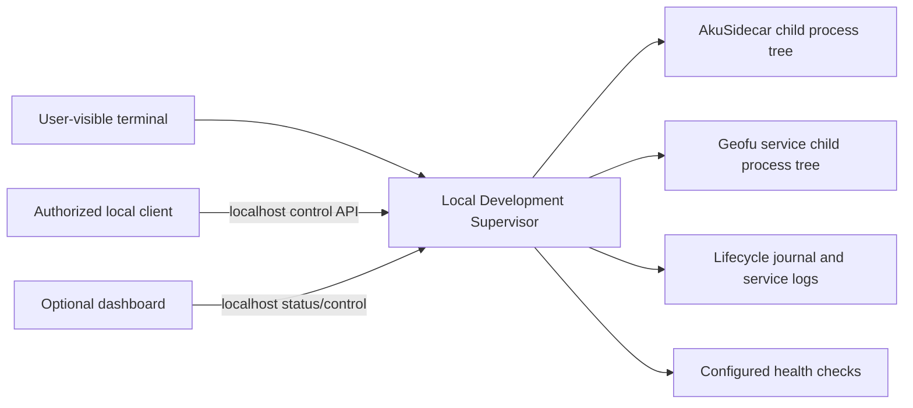

# Generic Local Development Supervisor v0

Status: **Proposed**  
Primary validation target: **AkuSidecar**  
Second validation target: **one Geofu service**  
Audience: implementation thread, AkuBrowser maintainers, Geofu maintainers

## 1. Problem

AkuSidecar must run in a normal Windows host process context. A server started through a restricted command runner can bind its port and pass HTTP health checks but later fail when it launches Codex CLI with `spawn EPERM`.

Starting AkuSidecar manually keeps the process visible and user-owned, but every hard restart then requires user intervention. Starting it as a hidden detached process gives an autonomous agent control, but makes process ownership and lifecycle less transparent to the user.

We need a small, generic local development supervisor that preserves both properties:

1. the user explicitly starts one visible supervisor process;
2. the supervisor owns project child processes;
3. an authorized local client may restart a child without restarting the supervisor;
4. every lifecycle action remains visible and auditable; and
5. the same supervisor can manage a service outside AkuBrowser, beginning with Geofu.

## 2. Product decision

The supervisor is a **development tool**, not an AkuSidecar responsibility and not a consumer-facing runtime requirement.

The user starts the supervisor manually in a visible terminal. Codex or another local tool may control only registered child services through the supervisor. Codex must not silently create a replacement supervisor when it is unavailable.

If the supervisor stops, user intervention is required once to start it again.

## 3. Goals

- Define services through configuration rather than project-specific code.
- Start, stop, restart, and inspect one or more named local services.
- Run child processes in a normal Windows host context.
- Keep the supervisor terminal visible and stream concise lifecycle events there.
- Preserve full stdout and stderr logs per service.
- Track launcher PID, runtime PID tree, port, health, and last lifecycle action.
- Expose a localhost-only authenticated control interface.
- Never terminate an unrelated process merely because it occupies an expected port.
- Support AkuSidecar first and prove portability with one Geofu service.
- Allow a future desktop launcher to reuse the lifecycle core.

## 4. Non-goals

Version 0 is not:

- a PM2, systemd, Docker Compose, Kubernetes, or Windows Service replacement;
- a production deployment orchestrator;
- a dependency graph or distributed service scheduler;
- a package installer;
- a secret manager;
- an arbitrary remote shell;
- a browser automation layer;
- responsible for starting Chrome, Brave, AkuBridge, Codex Desktop, or Codex CLI directly;
- allowed to execute commands that are not already declared in its configuration.

Automatic startup at Windows login, remote access, service groups, dependency ordering, rolling restarts, and multi-machine control are deferred.

## 5. User experience

### 5.1 User-owned startup

The user starts one visible process:

```powershell
cd <supervisor-project>
cargo run -- --config C:\path\to\local-dev-services.json
```

The terminal prints:

```text
Local Development Supervisor listening on 127.0.0.1:47820
Configuration: C:\path\to\local-dev-services.json
Control token: loaded from local runtime file

SERVICE       STATE      PID     HEALTH     LAST ACTION
akusidecar    running    28352   healthy    started by user
geofu-api     stopped    -       unknown    never started
```

The supervisor remains visible. Service output may be summarized in the terminal while complete logs are written to files.

### 5.2 Autonomous child restart

An authorized local client requests:

```text
restart akusidecar
reason: backend source changed; hard restart required
actor: codex
```

The supervisor:

1. validates the service name and token;
2. records the request;
3. stops only the recorded child process tree;
4. waits for confirmed termination;
5. starts the configured command in the configured working directory;
6. waits for process and health readiness;
7. records the result; and
8. exposes the new PIDs and status.

### 5.3 Failure boundary

If the supervisor itself is unavailable, clients report:

```text
Supervisor unavailable. Start it in the visible development terminal.
```

They must not silently fall back to a hidden server.

## 6. Architecture



The supervisor is the only component allowed to mutate the lifecycle of processes it started. A port observation is diagnostic evidence, not ownership evidence.

## 7. Project shape

AkuSupervisor is an independent Rust project. Domain and application code are
platform-neutral; operating-system process ownership is implemented through
separate adapters.

```text
AkuSupervisor/
  Cargo.toml
  docs/
  schemas/
  src/
    domain/
    application/
      platform_ports.rs
      service_runtime.rs
    adapters/
    platform/
      windows/
      linux/
      macos/
    cli.rs
    main.rs
  tests/
  README.md
```

The repository name is `AkuSupervisor`. Windows is the first implemented
backend; Linux and macOS adapter boundaries are reserved without weakening the
Windows MVP safety requirements.

## 8. Configuration contract

### 8.1 Minimal immutable-program example

```json
{
  "version": 1,
  "control": {
    "host": "127.0.0.1",
    "port": 47900,
    "tokenFile": ".runtime/immutable-example/control-token",
    "mcp": {
      "enabled": false,
      "allowedOrigins": []
    }
  },
  "services": {
    "legacy-api": {
      "label": "Immutable Legacy API",
      "cwd": "C:\\Tools\\LegacyApi",
      "command": "C:\\Tools\\LegacyApi\\legacy-api.exe",
      "args": ["--port", "8090"],
      "environment": {},
      "health": {
        "type": "process"
      },
      "ports": [8090],
      "restartPolicy": "manual",
      "shutdownGraceMs": 5000
    }
  }
}
```

This example intentionally assumes that the target cannot be modified. Source
changes are not required for process ownership, start, health observation, or
bounded cleanup. See the [configuration guide](configuration-guide.md) for
TCP/HTTP health variants, wrapper caveats, field descriptions, and actual
AkuWorkspace/Geofu profiles.

### 8.2 Required validation

At startup the supervisor must reject:

- unknown configuration versions;
- duplicate service names;
- relative or missing working directories;
- missing executables;
- control hosts other than loopback in v0;
- duplicate declared ports unless explicitly permitted in a future contract;
- commands assembled as one shell string;
- environment values outside the declared service entry; and
- token files outside the supervisor runtime directory unless explicitly allowed.

Commands and arguments remain separate arrays. The supervisor must not evaluate arbitrary shell text received through the API.

## 9. Service lifecycle model

Each service has one of these states:

```text
stopped -> starting -> running -> stopping -> stopped
                    -> unhealthy
          starting -> failed
          stopping -> failed
```

Additional observable attributes:

- `desiredState`: `running` or `stopped`;
- `launcherPid`;
- `listenerPids` when discoverable;
- `startedAt`;
- `lastHealthAt`;
- `lastExitCode`;
- `lastAction`;
- `lastActionActor`;
- `lastActionReason`;
- `restartCount` for the current supervisor session; and
- `configFingerprint`.

Transitions are serialized per service. Concurrent lifecycle mutations for the same service return `409 Conflict`.

## 10. Process ownership and Windows behavior

### 10.1 Ownership rule

The supervisor may stop only a process tree rooted at a PID it started and recorded during the current supervisor session.

It must never kill a process solely because:

- it uses the configured port;
- its command line resembles the configured command; or
- it is named `node.exe`, `npm.exe`, `powershell.exe`, or `cmd.exe`.

### 10.2 Port conflict

Before starting a service, the supervisor checks declared ports.

If a port is occupied by an unowned process, startup fails with a diagnostic containing the port and observable PID. The supervisor does not terminate the occupant.

### 10.3 Stop sequence

1. Mark the service `stopping`.
2. Request graceful termination when supported.
3. Wait `shutdownGraceMs`.
4. If descendants remain, terminate only the recorded owned tree.
5. Confirm the PIDs are gone.
6. Confirm declared ports are released or report the remaining external owner.
7. Mark the final state and journal the outcome.

The target program is not required to implement an AkuSupervisor-specific
shutdown protocol. If it handles the platform signal, the API and journal show
`forced: false`. If it does not, bounded owned-tree cleanup shows
`forced: true`. This distinction is operational evidence, not a different
ownership guarantee.

Language-specific optional integrations are maintained separately in
[Cooperative shutdown recipes](cooperative-shutdown-recipes.md). A recipe must
pass application-level and live Supervisor validation before it is marked
maintained.

The implementation must test npm's Windows process chain (`npm.cmd -> cmd.exe -> node --watch -> node server`) because stopping only the leaf server allows the watcher to recreate it.

### 10.4 Supervisor shutdown

On Ctrl+C, interactive `quit`, input closure, or watcher termination, the
required behavior is to stop every child service started by the current
supervisor instance, prove its owned process trees are empty, and only then
exit. This is the foreground-owner contract, not a configurable default.

A successful development watcher handoff uses the same cleanup mechanism for
the old instance and then explicitly restores the services observed running
under a new instance. Its lifecycle audit uses `recovery/supervisor`; a user
exit uses `user/cli`. The shared cleanup mechanism does not make those two
intentions equivalent.

A future `leaveRunningOnExit` or detached-daemon mode would require a separate
ownership and control contract and is out of scope for v0. It must not silently
change the meaning of Ctrl+C on the foreground owner.

## 11. Restart policy

Version 0 supports:

- `manual`: restart only after an authenticated request;
- `on-failure`: at most one automatic restart after an unexpected non-zero exit, followed by `failed` if it exits again within the stability window.

Default: `manual`.

There is no unlimited restart loop. Suggested defaults:

- stability window: 60 seconds;
- automatic restart cap: 1 per failure episode;
- manual restart always remains available.

The stability window is measured from the most recent successful launch. The
complete owned tree, not only the launcher PID, must be empty before an exit is
terminal. The exit observation is journaled before an `on-failure` recovery is
attempted. If that journal write fails, recovery fails closed. Any explicit
desired state of `stopped` suppresses a pending recovery, including a stop that
races with the exit monitor.

File watching remains the responsibility of the service command, such as Node `--watch` or Vite. The supervisor does not duplicate source-file watching.

## 12. Control interface

### 12.1 Binding and authentication

- Bind only to `127.0.0.1` in v0.
- Generate a high-entropy token on first startup.
- Store it in a local runtime file restricted to the current Windows user where feasible.
- Require `Authorization: Bearer <token>` for every mutation.
- Do not accept a token through query parameters.
- Redact the token from logs and error messages.
- Apply an explicit CORS allowlist if a browser dashboard is enabled.

### 12.2 HTTP API

```text
GET  /v1/health
GET  /v1/services
GET  /v1/services/:id
GET  /v1/events?after=<sequence>&limit=<n>
POST /v1/services/:id/start
POST /v1/services/:id/stop
POST /v1/services/:id/restart
```

### 12.3 Read-only MCP adapter

The optional MCP endpoint is a protocol adapter on the already-running
loopback server:

```text
POST /mcp
```

It is opt-in, stateless, and authenticated on every request. The AkuWorkspace
pilot exposes only list services, get service, recent events, and bounded log
reads. It advertises no lifecycle mutation, cooperative reload, resource,
prompt, sampling, task, session, SSE, or bootstrap capability. A present
`Origin` header must exactly match the configured allow-list. Disabling MCP
must not change CLI/HTTP lifecycle behavior, ownership, health, or cleanup.

Mutation body:

```json
{
  "actor": "codex",
  "reason": "backend startup configuration changed"
}
```

The API never accepts a command, working directory, executable path, argument list, or environment map. It can operate only on registered service IDs.

### 12.3 CLI

The same lifecycle core exposes:

```text
supervisor status
supervisor simple-status
supervisor start <service>
supervisor stop <service>
supervisor restart <service> --reason "..."
supervisor logs <service> --tail 100
```

CLI and HTTP actions produce the same journal records.

## 13. Health model

Supported v0 health types:

- `process`: owned root or descendant process is alive;
- `http-status`: endpoint returns the configured status;
- `http-json`: endpoint returns JSON matching a shallow set of expected fields.

Service status distinguishes:

- `processReady`: process tree exists;
- `transportReady`: configured port/HTTP endpoint responds;
- `healthy`: configured health expectations pass.

For AkuSidecar, HTTP health does not prove that Codex CLI can spawn. The supervisor reports transport health only. A real reasoning invocation remains an application-level readiness check performed by AkuSidecar or its existing operational diagnostics.

TCP and HTTP health targets are loopback-only in v0 and use an explicit IP and port.
Start and restart retry health until `startupDeadlineMs`. After startup, a
bounded periodic monitor refreshes health independently of status reads. A
spawned process that fails health remains owned and transitions to `unhealthy`;
a later passing observation returns it to `running`.

The loopback HTTP adapter accepts bounded HTTP/1.1 responses with either a
direct body or standard chunked transfer framing. Chunk sizes and terminators
are validated before status or JSON matching; malformed or truncated framing
fails health without releasing process ownership.

## 14. Logs and audit journal

Runtime layout:

```text
.runtime/
  control-token
  supervisor.jsonl
  services/
    akusidecar.stdout.log
    akusidecar.stderr.log
    geofu-api.stdout.log
    geofu-api.stderr.log
```

Every lifecycle event contains:

- monotonically increasing sequence;
- timestamp;
- supervisor instance ID;
- service ID;
- action;
- actor;
- reason;
- previous and resulting state;
- owned PIDs before and after;
- result and structured error category; and
- configuration fingerprint.

The durable journal is mandatory. An optional platform-neutral observability
setting controls whether the finalized canonical record is also mirrored to
the foreground console as `off`, concise `lifecycle` (default), or `verbose`.
Even `off` does not suppress failures from stderr. Console publication happens
only after persistence succeeds, and managed-service stdout/stderr remains a
separate log stream.

Minimum error categories:

- `config_invalid`;
- `already_running`;
- `already_stopped`;
- `port_conflict_external`;
- `spawn_failed`;
- `startup_timeout`;
- `health_failed`;
- `process_exited`;
- `shutdown_timeout`;
- `ownership_lost`;
- `unauthorized`; and
- `supervisor_internal_error`.

Logs use bounded rotation by size. Suggested default: five files of 5 MB per stream.

## 15. Optional dashboard integration

The initial implementation may ship CLI and API first. Dashboard integration follows without changing the lifecycle core.

A dashboard surface should show:

- supervisor ready/unavailable;
- service state and health;
- launcher and listener PIDs;
- last start/restart reason and actor;
- recent lifecycle events; and
- explicit Start, Stop, and Restart controls.

Controls must clearly state that they affect a local development process. The dashboard must not imply that it can restart the supervisor itself.

## 16. AkuSidecar integration

The first service profile must:

- run `npm run dev` from the AkuSidecar repository;
- inherit the normal user host context;
- use dashboard-persisted AkuSidecar configuration rather than force `AKU_REASONING_PROVIDER`;
- verify `/api/health` reports the expected version and provider;
- record both npm launcher and final listener PIDs when discoverable;
- stop the complete npm/watch/server process tree on hard restart; and
- preserve SQLite by default.

Database deletion is never part of restart. It requires a separate explicit development operation outside the supervisor v0 control API.

## 17. Geofu portability proof

After AkuSidecar passes, add exactly one Geofu service profile. Choose a service with:

- one documented startup command;
- one stable local working directory;
- a deterministic port or process check; and
- no dependency on another supervisor-managed service for the first proof.

Passing this proof means no Geofu-specific source code is required in the
supervisor; only configuration and, if necessary, a new generic health-check
type may be added. The managed Geofu program does not need source changes for
basic supervision. Optional signal handling may be added to demonstrate a
cooperative shutdown instead of the bounded forced fallback.

Multi-service Geofu orchestration and dependency ordering remain deferred.

After the independent proof passes, one configuration may register additional
long-running Geofu-family development modes. Every declared port still has one
configured owner; alternative modes that share a repository default must use
explicit port overrides or separate profiles. Startup order remains an explicit
operator or CLI choice; registration must not imply a dependency graph.

Repository tasks that copy artifacts, build releases, upload to cloud storage,
invalidate caches, or switch remote production state are not services. They
remain outside the supervisor even when they are adjacent to the daily
development workflow. AkuSupervisor may document their handoff points without
executing them or treating their success as local service health.

## 18. Acceptance criteria

### 18.1 Core

- The user can start the supervisor once in a visible terminal.
- An authenticated client can start, stop, and restart AkuSidecar without user interaction.
- Every action includes actor and reason in the journal.
- The supervisor exposes the current service state and owned PID tree.
- A failed health check is distinct from a failed process spawn.
- Two simultaneous restart requests cannot create duplicate service trees.

### 18.2 Windows safety

- Restarting AkuSidecar removes the old Go watcher/server/Codex tree before starting the new tree.
- An unrelated process occupying port 47821 is reported and never killed.
- An unrelated process remains untouched during every test.
- Ctrl+C on the supervisor cleanly stops its owned children.
- A stale recorded PID that has been reused by another process is not killed without matching current ownership evidence.

### 18.3 AkuSidecar

- `/api/health` passes with Go `1.0.0-dev.4`, Bridge Contract v2, and the
  `codex-app-server` provider.
- A normal restart preserves the current fresh-schema SQLite database.
- AkuSidecar can perform one real native Codex invocation and record structured
  output plus token telemetry.
- Lifecycle status remains readable while AkuSidecar itself is restarting.

### 18.4 Portability

- One unchanged executable can be managed through configuration with bounded
  ownership and forced cleanup available.
- A cooperative target additionally reports a non-forced shutdown, without
  creating a source-code dependency on AkuSupervisor.
- No AkuBrowser, AkuSidecar, or Geofu-specific import exists in the supervisor core.

## 19. Test strategy

### Unit tests

- configuration validation;
- lifecycle transition legality;
- token validation and redaction;
- journal schema;
- health matchers;
- restart cap;
- command/argument separation; and
- config fingerprint stability.

### Integration tests

Use fixture child processes that emulate:

- a healthy HTTP service;
- delayed startup;
- failed startup;
- a watcher that spawns a child server;
- failure followed by successful restart;
- a port occupied by an external fixture; and
- graceful and forced shutdown.

### Live validation

1. Start the supervisor visibly.
2. Start AkuSidecar through it.
3. Verify PID tree, port, health, and dashboard configuration.
4. Request a restart through the authenticated interface.
5. Verify the old tree is gone and the database is preserved.
6. Run one real AkuBrowser update to verify provider spawn.
7. Repeat the lifecycle test with the selected Geofu service.

## 20. Delivery plan

### Phase A — core MVP, approximately 4–6 hours

- project scaffold;
- configuration schema;
- visible CLI host;
- single-service process lifecycle;
- Windows process-tree ownership;
- file logs and JSONL journal;
- process, TCP-connect, and HTTP health checks; and
- tests with fixture services.

### Phase B — autonomous local control, approximately 2–4 hours

- loopback control server;
- token generation and authentication;
- serialized lifecycle mutations;
- status and event endpoints; and
- AkuSidecar service profile.

### Phase C — portability proof, approximately 2–4 hours

- selected Geofu service profile;
- configuration-only validation;
- fix generic abstraction gaps; and
- document both workflows.

### Phase D — optional UI, approximately 4–8 hours

- supervisor status panel;
- lifecycle controls;
- recent-event display;
- clear unavailable state; and
- browser CORS/token handoff appropriate for local development.

Expected engineering effort for the CLI/API MVP plus AkuSidecar and one Geofu proof: **approximately one to two focused engineering days**. A polished dashboard and broader multi-service behavior are additional work.

## 21. Explicit implementation boundaries

Stop and reassess before adding any of the following:

- service dependency graphs;
- arbitrary shell execution through the API;
- network binding beyond loopback;
- Windows login startup;
- remote agents;
- database-reset actions;
- browser lifecycle management;
- production service installation; or
- more than one automatic restart per failure episode.

If these become necessary, first compare the expanded requirement with PM2, Docker Compose, and native Windows Service tooling instead of growing an accidental general-purpose orchestrator.

## 22. Implementation-thread starting brief

The implementation thread should begin with this bounded objective:

> Build a generic, configuration-driven Windows local development supervisor. The user starts it once in a visible terminal. It owns and audits registered child service process trees and exposes localhost-authenticated start, stop, restart, status, and event operations. Validate it first with AkuSidecar, including the npm/watch/server process chain and preservation of SQLite, then prove portability with one independently runnable Geofu service. Do not add arbitrary command execution, dependency orchestration, background login startup, or database reset.
