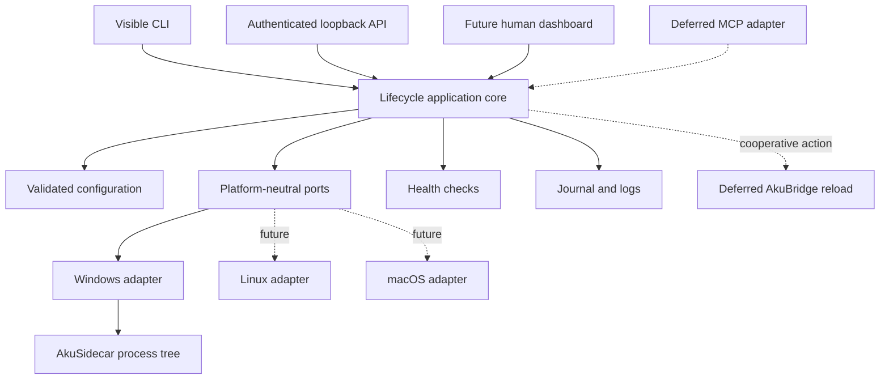

# AkuSupervisor Implementation Roadmap

Status: **Active planning control**  
Initial scope: **AkuWorkspace on Windows**  
Implementation language: **Rust**  
First live service: **AkuSidecar**

## 1. Purpose

This roadmap controls implementation order and prevents deferred ideas from entering the MVP without an explicit gate decision.

The original product specification remains the detailed source for lifecycle behavior and safety requirements. This roadmap records subsequent decisions that supersede parts of the proposed implementation approach:

- use Rust instead of Node.js;
- validate only AkuWorkspace initially;
- defer Geofu, GeoLibre, and Geofu_be portability validation;
- plan AkuBridge self-reload, but implement it only after service lifecycle stability;
- plan MCP as an adapter, but do not put it in the lifecycle core; and
- treat agent-started supervisor bootstrap as a separate later feature.

## 2. Non-negotiable principles

1. **Normal host context:** managed services must not inherit a restricted agent runner context.
2. **Evidence-based ownership:** stop only process trees started and recorded by the current supervisor instance.
3. **User authority:** explicit user control overrides agent desired state and automatic restart.
4. **No arbitrary execution:** commands, arguments, working directories, and environments come only from validated configuration.
5. **Visible and auditable:** every action records requester, reason, transition, owned PIDs, result, and error category.
6. **One lifecycle core:** CLI, UI, HTTP, future MCP, and future launchers call the same application services.
7. **Portability by boundary:** keep project-specific details in configuration, but defer non-AkuWorkspace live validation.
8. **Bounded scope:** do not add service graphs, remote control, login startup, browser automation, or production orchestration during the MVP.

## 3. Target architecture



## 4. Delivery phases

### Phase 0 - Rust foundation

Status: **Completed - Gate 0 passed**

Current checkpoint:

- [x] Rustup installed for the current Windows user.
- [x] Stable `x86_64-pc-windows-msvc` toolchain selected as the default.
- [x] Cargo, rustfmt, Clippy, and rust-analyzer installed.
- [x] Visual Studio MSVC x64/x86 tools and Windows 11 SDK detected.
- [x] Replace the temporary Node scaffold with the Cargo project.
- [x] Build and run the first linked AkuSupervisor binary.
- [x] Run the complete formatting, linting, and test baseline.

Deliverables:

- install and verify the Rust MSVC toolchain;
- replace the temporary Node scaffold with a Cargo binary project;
- establish module boundaries for domain, application, adapters, and Windows platform code;
- add formatting, linting, and test commands;
- add CI-ready commands that also run locally; and
- preserve the specification and planning documents.

Suggested baseline commands:

```text
cargo fmt --check
cargo clippy --all-targets --all-features -- -D warnings
cargo test --all-targets --all-features
```

Gate 0:

- `rustc`, `cargo`, and the `x86_64-pc-windows-msvc` target are available;
- a minimal binary builds and runs;
- all baseline checks pass; and
- no Node runtime is required by AkuSupervisor.

### Phase 1 - Domain model, configuration, and journal

Status: **Completed - Gate 1 passed**

Completed checkpoint:

- [x] Lifecycle states and legal-transition tests.
- [x] Typed actor, reason, desired-state, and operator-hold policy.
- [x] Versioned JSON parsing with duplicate service-ID rejection.
- [x] Loopback, runtime-token, filesystem, health, and port validation.
- [x] Stable SHA-256 configuration fingerprint.
- [x] Deterministic JSONL journal contract and known-secret redaction.
- [x] Checked-in JSON Schema aligned with the typed field names.

Deliverables:

- versioned configuration types and JSON Schema alignment;
- absolute path, executable, loopback host, port, and token-path validation;
- lifecycle state machine and transition tests;
- typed actor, reason, desired state, and operator-hold policy;
- stable configuration fingerprint;
- JSONL journal schema and redaction rules; and
- canonical error categories.

Gate 1:

- invalid configurations fail before any process is started;
- illegal transitions are unrepresentable or rejected;
- user operator hold blocks agent mutation in tests;
- journal records are deterministic and redact secrets; and
- invocation input cannot supply a command or environment.

### Phase 2 - Windows process ownership vertical slice

Status: **Complete - Gate 2 passed**

Current checkpoint:

- complete: suspended root creation, Job Object assignment before resume, and
  inherited descendant ownership;
- complete: graceful Ctrl+Break request, bounded Job Object termination, and
  kill-on-close cleanup;
- complete: current Job membership as the destructive-operation authority;
- complete: read-only IPv4/IPv6 TCP port-to-PID diagnostics;
- verified: owned parent and child stop while an unrelated process remains;
- verified: port inspection reports the occupant without disrupting it; and
- complete: per-service lifecycle serialization prevents duplicate concurrent
  starts and retains ownership after a failed stop; and
- verified: the Ctrl+C handler uses a lock-free request flag, while a targeted
  console-interruption fixture proves cleanup finishes before supervisor exit.
- complete: platform-neutral process, port, and shutdown contracts isolate the
  application layer from Windows implementation types.

Deliverables:

- process creation in the normal host context;
- Windows Job Object or equivalent owned-tree boundary;
- launcher PID and descendant observation;
- graceful shutdown followed by bounded forced termination;
- PID identity and reuse safeguards;
- declared-port diagnostics without port-based killing;
- Ctrl+C cleanup; and
- fixture processes for parent, watcher, server, and unrelated process cases.

Gate 2:

- the complete owned fixture tree stops without touching an unrelated process;
- a port conflict produces diagnostics and never kills the occupant;
- Ctrl+C stops owned children;
- concurrent lifecycle mutations cannot create duplicate trees; and
- a reused PID is not killed without current ownership evidence.

Gate 2 evidence is covered by the process-ownership, console-shutdown,
port-observer, and service-runtime tests. Destructive operations accept only a
live Job Object owner; observed PIDs and ports have no termination API.

### Phase 3 - Visible CLI and local control API

Status: **In progress - foreground CLI checkpoint complete**

Current checkpoint:

- complete: validated configuration maps to platform-neutral service
  registrations;
- complete: one shared application registry owns start, stop, restart, status,
  port checks, operator holds, actor, and reason;
- complete: visible `run --config <path>` foreground supervisor with an
  interactive status table and Ctrl+C/quit cleanup;
- complete: no-argument startup resolves `AKU_SUPERVISOR_CONFIG` then the
  platform default user configuration and fails clearly when neither exists;
- verified: an end-to-end fixture performs start, status, restart, stop, and
  quit without leaving an owned process tree;
- verified: user stop blocks a later agent start in the shared registry;
- verified: startup reports the absolute configuration path and its discovery
  source;
- prepared: a checked-in AkuWorkspace profile registers AkuSidecar without
  overriding its persisted dashboard configuration;
- remaining: persistent journal/events, bounded service logs, authenticated
  loopback HTTP, runtime token handling, and request idempotency.

Deliverables:

- visible supervisor startup and status table;
- start, stop, restart, status, events, and bounded-log CLI commands;
- loopback-only authenticated HTTP API;
- runtime token generation and redaction;
- per-service mutation serialization;
- action idempotency or duplicate protection;
- actor and reason propagation; and
- operator-hold controls.

Gate 3:

- CLI and HTTP produce identical canonical journal records;
- unauthorized mutations fail without state change;
- user stop prevents subsequent agent restart until the hold is cleared;
- the supervisor never creates commands from request data; and
- the user can inspect and control all running services without Codex.

### Phase 4 - AkuSidecar live validation

Status: **Pending Gate 3**

Deliverables:

- an AkuSidecar service profile using its normal persisted configuration;
- `npm.cmd -> cmd.exe -> node --watch -> node server` tree validation;
- process, transport, and HTTP JSON health reporting;
- hard restart with complete old-tree removal;
- SQLite preservation checks;
- a real reasoning invocation after supervisor launch and restart; and
- documented visible operator workflow.

Gate 4:

- AkuSidecar starts in a normal host context;
- `/api/health` reports the expected version and provider;
- a real reasoning invocation does not immediately fail with `spawn EPERM`;
- restart removes the old watcher/server tree;
- SQLite is preserved; and
- lifecycle status remains visible throughout restart.

Gate 4 marks the first usable AkuSupervisor MVP.

### Phase 5 - AkuBridge cooperative reload

Status: **Deferred until Gate 4**

Deliverables:

- a narrow `reload_self` cooperative action;
- authenticated request and audit path;
- relay through the existing AkuBrowser-to-AkuBridge messaging boundary;
- `chrome.runtime.reload()` invocation;
- expected disconnect handling; and
- post-reload heartbeat/build-identity verification.

Gate 5:

- reloading AkuBridge no longer requires Computer Use or `chrome://extensions` interaction;
- Chrome, tabs, profile, and login state remain running;
- a new build identity is observed after reload;
- disabled or unreachable extension state fails closed to a manual fallback; and
- no `chrome.management`, CDP, or whole-browser restart is introduced.

### Phase 6 - MCP adapter

Status: **Deferred until Gate 4; preferably after Gate 5**

Deliverables and acceptance criteria are maintained in [MCP Integration Notes](mcp-integration-notes.md).

The primary design is authenticated local Streamable HTTP. A stdio process, if required, is a proxy to the already-running supervisor and never owns managed services.

Gate 6:

- read-only MCP operations are proven before mutations are enabled;
- MCP mutations obey the same authorization, operator hold, and audit rules as CLI and HTTP;
- disabling MCP does not affect lifecycle correctness; and
- the MCP adapter does not become a bootstrap mechanism.

### Phase 7 - Agent-initiated supervisor bootstrap

Status: **Deferred and requires a separate design decision**

Goal:

Allow Codex to request launch of AkuSupervisor when no supervisor instance is running, while preserving normal host context and user visibility.

Required design work:

- select a trusted user-session launcher mechanism;
- require explicit user opt-in;
- make launches visible through terminal, tray, or notification;
- enforce a single supervisor instance;
- record who requested bootstrap and why;
- provide immediate human stop and disable controls; and
- prove that managed descendants do not inherit the restricted agent context.

Do not implement this phase by directly spawning AkuSupervisor from an ordinary restricted agent runner.

### Phase 8 - Geofu portability validation

Status: **Deferred**

Potential future targets:

- Geofu;
- GeoLibre; and
- Geofu_be.

Begin with exactly one independently runnable service profile. Add the remaining profiles only after the first portability proof passes without project-specific changes to the lifecycle core.

### Phase 9 - Linux and macOS platform adapters

Status: **Boundary prepared; implementation deferred until the Windows MVP is stable**

The shared contracts and proposed adapter strategies are maintained in
[Platform Portability Boundary](platform-portability.md).

Deliverables:

- implement Linux and macOS process ownership behind `ProcessTreeSpawner` and
  `ManagedProcessTree` without changing lifecycle application code;
- implement platform-native port diagnostics and shutdown signals;
- add native CI jobs and process-tree fixtures for each operating system;
- prove unrelated-process and PID-reuse safety independently on each OS; and
- document any capability difference rather than weakening the shared contract.

Gate 9:

- the application and domain layers compile unchanged on all three OS targets;
- each native backend passes equivalent ownership, concurrency, port, and
  shutdown tests; and
- no backend claims support by falling back to process-name or port-based kill.

## 5. Cross-phase testing strategy

Every phase must preserve:

- unit tests for domain rules;
- integration fixtures for process behavior;
- Windows-specific tests for ownership and shutdown;
- architecture tests that reject OS imports in domain and application code;
- native Linux and macOS jobs when their adapters are implemented;
- an unrelated-process safety test;
- authentication and redaction regression tests;
- deterministic journal assertions; and
- manual live-validation steps only where OS or browser state cannot be faithfully emulated.

Live tests that can stop processes or reload an extension must be clearly separated from the default unit-test command.

## 6. Deferred-feature register

The following items require an explicit roadmap update before implementation:

- MCP integration;
- AkuBridge reload;
- Codex-initiated AkuSupervisor bootstrap;
- automatic Windows login startup;
- tray application or Windows Service;
- Geofu-family validation;
- Linux and macOS platform implementations;
- remote network access;
- dependency graphs or service groups;
- database reset operations;
- arbitrary hooks or shell commands;
- Chrome process lifecycle management; and
- production deployment orchestration.

## 7. Definition of MVP complete

The AkuWorkspace MVP is complete only when Gates 0 through 4 pass and:

- the user can start one visible AkuSupervisor process;
- the user or an authorized local client can manage AkuSidecar;
- user control has priority over agent requests;
- all actions are auditable;
- Windows process ownership safety tests pass;
- AkuSidecar survives a hard restart with its database preserved; and
- one real reasoning invocation proves the required normal host context.

AkuBridge reload, MCP, agent bootstrap, and Geofu portability are not required for the first MVP.
