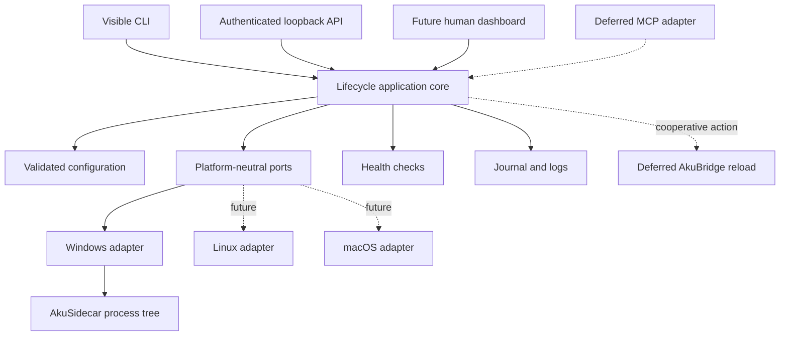

# AkuSupervisor Implementation Roadmap

Status: **Historical implementation record; active behavior is defined by the README, configuration guide, and testing guide**
Initial scope: **AkuWorkspace on Windows**  
Implementation language: **Rust**  
First live service: **AkuSidecar**

## 1. Purpose

This roadmap records the implementation order and gate decisions used to reach the MVP. Dated Sidecar providers, versions, Bridge builds, and validation results below are historical evidence, not current AkuWorkspace compatibility targets.

The original product specification remains the detailed source for lifecycle behavior and safety requirements. This roadmap records subsequent decisions that supersede parts of the proposed implementation approach:

- use Rust instead of Node.js;
- validate only AkuWorkspace initially;
- defer Geofu, GeoLibre, and Geofu_be portability validation;
- plan AkuBridge self-reload, but implement it only after service lifecycle stability;
- plan MCP as an adapter, but do not put it in the lifecycle core; and
- treat agent-started supervisor bootstrap as a separate later feature.

## 2. Non-negotiable principles

1. **Normal host context:** managed services must not inherit a restricted agent runner context.
2. **Evidence-based ownership:** stop only process trees started and recorded by the current supervisor instance.
3. **User authority:** explicit user control overrides agent desired state and automatic restart.
4. **No arbitrary execution:** commands, arguments, working directories, and environments come only from validated configuration.
5. **Visible and auditable:** every action records requester, reason, transition, owned PIDs, result, and error category.
6. **One lifecycle core:** CLI, UI, HTTP, future MCP, and future launchers call the same application services.
7. **Portability by boundary:** keep project-specific details in configuration, but defer non-AkuWorkspace live validation.
8. **Bounded scope:** do not add service graphs, remote control, login startup, browser automation, or production orchestration during the MVP.

Cross-component readiness remains layered on this lifecycle core. A managed
application may publish a per-process epoch so its existing clients can recover
after replacement, but the epoch is not interpreted by AkuSupervisor and does
not create a dependency graph. The original Node Sidecar 0.6.9 was the reference
example when this roadmap was written; the current Go Sidecar preserves the
same application-owned invariant.

## 3. Target architecture



## 4. Delivery phases

### Phase 0 - Rust foundation

Status: **Completed - Gate 0 passed**

Current checkpoint:

- [x] Rustup installed for the current Windows user.
- [x] Stable `x86_64-pc-windows-msvc` toolchain selected as the default.
- [x] Cargo, rustfmt, Clippy, and rust-analyzer installed.
- [x] Visual Studio MSVC x64/x86 tools and Windows 11 SDK detected.
- [x] Replace the temporary Node scaffold with the Cargo project.
- [x] Build and run the first linked AkuSupervisor binary.
- [x] Run the complete formatting, linting, and test baseline.

Deliverables:

- install and verify the Rust MSVC toolchain;
- replace the temporary Node scaffold with a Cargo binary project;
- establish module boundaries for domain, application, adapters, and Windows platform code;
- add formatting, linting, and test commands;
- add CI-ready commands that also run locally; and
- preserve the specification and planning documents.

Suggested baseline commands:

```text
cargo fmt --check
cargo clippy --all-targets --all-features -- -D warnings
cargo test --all-targets --all-features
```

Gate 0:

- `rustc`, `cargo`, and the `x86_64-pc-windows-msvc` target are available;
- a minimal binary builds and runs;
- all baseline checks pass; and
- no Node runtime is required by AkuSupervisor.

### Phase 1 - Domain model, configuration, and journal

Status: **Completed - Gate 1 passed**

Completed checkpoint:

- [x] Lifecycle states and legal-transition tests.
- [x] Typed actor, reason, desired-state, and operator-hold policy.
- [x] Versioned JSON parsing with duplicate service-ID rejection.
- [x] Loopback, runtime-token, filesystem, health, and port validation.
- [x] Stable SHA-256 configuration fingerprint.
- [x] Deterministic JSONL journal contract and known-secret redaction.
- [x] Checked-in JSON Schema aligned with the typed field names.

Deliverables:

- versioned configuration types and JSON Schema alignment;
- absolute path, executable, loopback host, port, and token-path validation;
- lifecycle state machine and transition tests;
- typed actor, reason, desired state, and operator-hold policy;
- stable configuration fingerprint;
- JSONL journal schema and redaction rules; and
- canonical error categories.

Gate 1:

- invalid configurations fail before any process is started;
- illegal transitions are unrepresentable or rejected;
- user operator hold blocks agent mutation in tests;
- journal records are deterministic and redact secrets; and
- invocation input cannot supply a command or environment.

### Phase 2 - Windows process ownership vertical slice

Status: **Complete - Gate 2 passed**

Current checkpoint:

- complete: suspended root creation, Job Object assignment before resume, and
  inherited descendant ownership;
- complete: graceful Ctrl+Break request, bounded Job Object termination, and
  kill-on-close cleanup;
- complete: current Job membership as the destructive-operation authority;
- complete: read-only IPv4/IPv6 TCP port-to-PID diagnostics;
- verified: owned parent and child stop while an unrelated process remains;
- verified: port inspection reports the occupant without disrupting it; and
- complete: per-service lifecycle serialization prevents duplicate concurrent
  starts and retains ownership after a failed stop; and
- verified: the Ctrl+C handler uses a lock-free request flag, while a targeted
  console-interruption fixture proves cleanup finishes before supervisor exit.
- complete: platform-neutral process, port, and shutdown contracts isolate the
  application layer from Windows implementation types.

Deliverables:

- process creation in the normal host context;
- Windows Job Object or equivalent owned-tree boundary;
- launcher PID and descendant observation;
- graceful shutdown followed by bounded forced termination;
- PID identity and reuse safeguards;
- declared-port diagnostics without port-based killing;
- Ctrl+C cleanup; and
- fixture processes for parent, watcher, server, and unrelated process cases.

Gate 2:

- the complete owned fixture tree stops without touching an unrelated process;
- a port conflict produces diagnostics and never kills the occupant;
- Ctrl+C stops owned children;
- concurrent lifecycle mutations cannot create duplicate trees; and
- a reused PID is not killed without current ownership evidence.

Gate 2 evidence is covered by the process-ownership, console-shutdown,
port-observer, and service-runtime tests. Destructive operations accept only a
live Job Object owner; observed PIDs and ports have no termination API.

### Phase 3 - Visible CLI and local control API

Status: **Completed - Gate 3 passed**

Current checkpoint:

- complete: validated configuration maps to platform-neutral service
  registrations;
- complete: one shared application registry owns start, stop, restart, status,
  port checks, operator holds, actor, and reason;
- complete: visible `run --config <path>` foreground supervisor with an
  interactive status table and Ctrl+C/quit cleanup;
- complete: no-argument startup resolves `AKU_SUPERVISOR_CONFIG` then the
  platform default user configuration and fails clearly when neither exists;
- verified: an end-to-end fixture performs start, status, restart, stop, and
  quit without leaving an owned process tree;
- verified: user stop blocks a later agent start in the shared registry;
- verified: startup reports the absolute configuration path and its discovery
  source;
- prepared: a checked-in AkuWorkspace profile registers AkuSidecar without
  overriding its persisted dashboard configuration;
- complete: loopback HTTP exposes health and service status plus
  bearer-authenticated registered-service mutations;
- complete: a 256-bit CNG token is created atomically, stored beneath the
  configured runtime directory, compared without early exit, and redacted from
  debug output;
- complete: a bounded second-process client supports status, start, stop, and
  restart with explicit actor and reason;
- verified: invalid tokens cannot mutate state and a user stop hold rejects a
  later Codex start through the HTTP boundary;
- verified: shared HTTP, client, token, and application control code contains
  no Windows implementation import;
- complete: persistent monotonic JSONL journal and bounded `events` retrieval;
- complete: persisted lifecycle events can be mirrored to the visible console
  as `off`, default `lifecycle`, or `verbose`, while failures remain visible;
- complete: continuously rotated per-service stdout/stderr logs and bounded
  `logs` retrieval;
- complete: protected current-user-only token-file DACL through the Windows
  security adapter; and
- complete: bounded request IDs replay identical mutations and reject reuse
  with different input.

Deliverables:

- visible supervisor startup and status table;
- start, stop, restart, status, events, and bounded-log CLI commands;
- loopback-only authenticated HTTP API;
- runtime token generation and redaction;
- per-service mutation serialization;
- action idempotency or duplicate protection;
- actor and reason propagation; and
- operator-hold controls.

Gate 3:

- CLI and HTTP produce identical canonical journal records;
- unauthorized mutations fail without state change;
- user stop prevents subsequent agent restart until the hold is cleared;
- the supervisor never creates commands from request data; and
- the user can inspect and control all running services without Codex.

### Phase 4 - AkuSidecar live validation

Status: **Completed - Gate 4 passed on 2026-07-14**

Live evidence:

- AkuSidecar `0.5.13` started under the authenticated local client;
- its port `11122` listener PID was a member of the supervisor-owned Job Object;
- `/api/health` returned `status=ok` and `provider=codex-sdk`;
- a synthetic bounded run completed a real `candidate_evaluation` with
  `gpt-5.6-terra` at high reasoning effort;
- restart removed every PID from the old npm/cmd/watcher/server tree and
  produced a disjoint owned tree; and
- SQLite remained healthy with integrity `ok`, zero foreign-key violations,
  unchanged table counts, and the completed validation run still readable.

Deliverables:

- an AkuSidecar service profile using its normal persisted configuration;
- `npm.cmd -> cmd.exe -> node --watch -> node server` tree validation;
- process, transport, and HTTP JSON health reporting;
- hard restart with complete old-tree removal;
- SQLite preservation checks;
- a real reasoning invocation after supervisor launch and restart; and
- documented visible operator workflow.

Gate 4:

- AkuSidecar starts in a normal host context;
- `/api/health` reports the expected version and provider;
- a real reasoning invocation does not immediately fail with `spawn EPERM`;
- restart removes the old watcher/server tree;
- SQLite is preserved; and
- lifecycle status remains visible throughout restart.

Gate 4 marks the first usable AkuSupervisor MVP.

### Phase 5 - AkuBridge cooperative reload

Status: **Completed - Gate 5 passed on 2026-07-14**

Current checkpoint:

- [x] narrow `reload_self` application boundary, authenticated HTTP route, and CLI;
- [x] separate fail-closed cooperative action audit;
- [x] Sidecar in-memory action queue with bounded TTL and request replay protection;
- [x] same-origin AkuBrowser tab relay and bridge-token acknowledgement;
- [x] direct `chrome.runtime.reload()` with expected disconnect handling;
- [x] post-reload heartbeat and exact build-identity completion rule;
- [x] unit and HTTP contract coverage for authorization, timeout, replay, and completion;
- [x] one-time manual bootstrap of the first handler-capable unpacked build; and
- [x] live Chrome proof followed by Gate 5 sign-off.

Live evidence:

- AkuBridge `0.5.15` / `source-fidelity-v17` advertised `reload_self` and
  passed Sidecar compatibility;
- the authenticated CLI action completed with the expected and observed build
  identity equal to `aku-bridge-0.5.15-source-fidelity-v17`;
- the post-reload heartbeat timestamp was newer than the pre-reload heartbeat;
- the audit journal recorded matching `requested` and `completed` records;
- Chrome and the existing AkuBrowser, X, LinkedIn, and extensions tabs retained
  their tab identities; and
- AkuSidecar remained healthy and Supervisor-owned throughout validation.

Deliverables:

- a narrow `reload_self` cooperative action;
- authenticated request and audit path;
- relay through the existing AkuBrowser-to-AkuBridge messaging boundary;
- `chrome.runtime.reload()` invocation;
- expected disconnect handling; and
- post-reload heartbeat/build-identity verification.

Gate 5:

- reloading AkuBridge no longer requires Computer Use or `chrome://extensions` interaction;
- Chrome, tabs, profile, and login state remain running;
- a new build identity is observed after reload;
- disabled or unreachable extension state fails closed to a manual fallback; and
- no `chrome.management`, CDP, or whole-browser restart is introduced.

### Phase 5.1 - Cooperative reload reliability

Status: **Completed - Gate 5.1 passed on 2026-07-14**

Current checkpoint:

- [x] Sidecar action delivery uses a bounded long poll instead of a one-second
  background page timer;
- [x] the service worker reloads only the originating AkuBrowser tab without a
  page-side reload timer;
- [x] the new extension worker consumes a short-lived persisted tab marker, so
  runtime reload cannot invalidate the content script needed for heartbeat;
- [x] disconnected long-poll waiters are cancelled and cannot steal a later
  action;
- [x] Supervisor runs the bounded relay in a background worker and keeps status
  requests responsive;
- [x] request-ID status lookup, terminal replay, and single-flight conflict
  behavior are exposed through HTTP and CLI;
- [x] progress and audit preserve relay creation, delivery, acceptance,
  heartbeat, terminal state, relay ID, and stage-specific failure categories;
- [x] Codex is retained as structured actor identity instead of a generic
  agent;
- [x] `--json`, `--wait`, `--no-wait`, and `bridge status` provide automation-
  safe CLI control;
- [x] transient control transport failures receive bounded retry only when the
  request is read-only or request-ID idempotent;
- [x] the AkuWorkspace health profile checks the stable bridge contract and
  provider instead of pinning the frequently changing Sidecar app version; and
- [x] prove a real reload after the AkuBrowser relay tab has remained in the
  background for at least five minutes.

Gate 5.1:

- status remains queryable while reload is active;
- an unrelated second request is rejected while the first is active;
- a same-ID retry never triggers a second extension reload;
- a terminal failure names the last unproven relay stage; and
- background-tab throttling does not prevent delivery or page refresh.

Live evidence used request `gate51-live-20260714-014` after more than five
minutes without interacting with the AkuBrowser tab. It completed in 1.7
seconds on `aku-bridge-0.5.18-source-fidelity-v20`. The cooperative journal
recorded `requested`, `relay_created`, `delivered`, `accepted`,
`heartbeat_observed`, and `completed` in order with one relay action ID and the
structured Codex actor. Sidecar health remained `healthy` with the expected
build ID.

### Development workflow checkpoint

Status: **Completed and live-validated on 2026-07-14**

- [x] constant development executable at `target/dev/aku-supervisor.exe`;
- [x] incremental staged build while the active Supervisor remains available;
- [x] failed builds leave the active Supervisor and services untouched;
- [x] opt-in bounded file signal follows the normal cleanup path without adding
  a production shutdown endpoint;
- [x] successful handoff restores only services observed running before restart;
- [x] PowerShell watcher resolves the project-local Cargo toolchain when Cargo
  is absent from `PATH`;
- [x] VS Code task and manual control workflow documented;
- [x] optional positional service IDs let the watcher start AkuSidecar after
  Supervisor readiness while preserving Supervisor-only default behavior;
- [x] watcher startup and post-rebuild banners distinguish active development
  and normal stable binaries and print the safe transition sequence;
- [x] startup and post-cleanup handoff require an exclusively replaceable
  development executable, diagnose a matching portless PID when discoverable,
  and never force-kill the file owner; and
- [x] a byte-identical staged build skips unnecessary replacement so a
  read-only MCP proxy cannot suppress watcher startup or its normal banner;
- [x] portable signal contract separated from the Windows runner.

Live evidence used an isolated control port. The Supervisor PID changed from
`40496` to `38556`, the running fixture was restored from PID `43312` to
`42056`, and the final cleanup left neither the test listener nor known fixture
processes alive. The normal stable Supervisor remained active throughout.

### Release validation checkpoint

Status: **Completed and live-validated on 2026-07-14**

- [x] `bridge validate` performs a fresh cooperative reload and emits one
  deterministic JSON result;
- [x] the gate verifies six ordered audit stages, structured actor/request
  identity, expected/observed heartbeat equality, and no active zombie action;
- [x] success exits `0`, validation/execution failure exits `1`, and CLI usage
  errors exit `2`;
- [x] `scripts/validate-akuworkspace-integration.ps1` owns the optional
  AkuSidecar/AkuBridge preflight and refuses nonzero, failed, or malformed
  validation output without touching stable;
- [x] `scripts/promote-stable.ps1` is a separate generic core promotion adapter
  with bounded candidate execution, byte-identical short-circuit, Windows lock
  diagnostics, copy, and SHA-256 verification;
- [x] AkuWorkspace integration validation is explicitly removable without
  changing the core promotion contract; and
- [x] release evaluation remains platform-neutral while PowerShell owns only
  the Windows copy adapter.

Live request `bridge-validate-live-20260714-002` passed all five checks against
`aku-bridge-0.5.19-source-fidelity-v21`. Reusing that request ID with a
different actor returned JSON status `error` and exit code `1` without a
second reload. The integration gate rejected the result without invoking core
promotion.

### Runtime health checkpoint

Status: **Completed and live-validated on 2026-07-14**

- [x] `process`, loopback `http-status`, and `http-json` checks map to a
  platform-neutral health contract; `http-json` preserves shallow scalar
  matching by default and supports opt-in RFC 6901 nested lookup;
- [x] start and restart wait up to `startupDeadlineMs` and report
  `health_failed` separately from `spawn_failed`;
- [x] an unhealthy process remains inside the authoritative ownership boundary;
- [x] a one-second monitor updates health without requiring a status read and
  permits `unhealthy -> running` recovery;
- [x] API/CLI snapshots distinguish process readiness, transport readiness,
  matched health, timestamp, and bounded diagnostic detail; and
- [x] HTTP probing uses a shared `std::net` adapter with no Windows or CNG
  dependency.

Live AkuSidecar evidence reported `running / healthy`, `processReady=true`,
`transportReady=true`, and three matching JSON fields. Two snapshots three
seconds apart showed `checkedAtUnixMs` advancing without a lifecycle command.
The isolated test suite covered health failure with retained ownership and
later recovery.

### Process-exit supervision checkpoint

Status: **Completed and live-validated on 2026-07-14**

- [x] terminal detection requires an empty authoritative owned tree plus an
  observable launcher exit status;
- [x] launcher exit with a living descendant preserves ownership and running
  lifecycle;
- [x] terminal owners are released exactly once and snapshots expose desired
  state, start/exit timestamps, exit code, and restart count;
- [x] `manual` permits authenticated recovery without an automatic restart;
- [x] `on-failure` performs at most one audited recovery per 60-second unstable
  episode and a stable runtime opens a new episode;
- [x] explicit user or agent stop wins a race with planned recovery;
- [x] process exit is journaled before recovery with deterministic exit and
  restart-planned metadata; and
- [x] Windows integration fixtures prove owner release, manual recovery,
  automatic recovery, crash-loop cap, and audit persistence.

The active AkuSidecar remained `running / healthy` after watcher handoff and
reported the new supervision fields. A separate real Windows fixture exited
with code `17`: the manual service became startable again, while the
`on-failure` service restarted once and remained `failed` after its second
crash.

### Phase 6 - MCP adapter

Status: **Read-only checkpoint completed and live-validated on 2026-07-14**

Deliverables and acceptance criteria are maintained in [MCP Integration Notes](mcp-integration-notes.md).

The primary design is authenticated local Streamable HTTP. A stdio process, if required, is a proxy to the already-running supervisor and never owns managed services.

Gate 6:

- [x] read-only MCP operations are proven through contract, integration, and
  live AkuWorkspace validation before mutations are considered;
- MCP mutations obey the same authorization, operator hold, and audit rules as CLI and HTTP;
- disabling MCP does not affect lifecycle correctness; and
- the MCP adapter does not become a bootstrap mechanism.

Current checkpoint:

- [x] opt-in authenticated `/mcp` endpoint on the existing loopback listener;
- [x] stateless initialize, ping, tools/list, initialized notification, and four
  bounded read-only tool calls;
- [x] no lifecycle mutation, cooperative reload, bootstrap, resources, prompts,
  sampling, Tasks, sessions, or SSE capability;
- [x] exact Origin allow-list when an Origin header is present;
- [x] adapter isolation from the lifecycle and platform layers; and
- [x] bounded stdio proxy and project-scoped Codex registration without copying
  the bearer token into Codex config or environment; and
- [x] explicit plan/apply Codex bootstrap for both MCP identities, with a
  hash-bound approval code, unrelated-config preservation, verified dedicated
  host staging, atomic config replacement, and temporary integration fixture;
- [x] live tool invocation from a newly started Codex task.

Live validation used the active development Supervisor at
`http://127.0.0.1:11121/mcp`. It negotiated protocol `2025-11-25`, exposed the
exact four read-only tools, read AkuSidecar as `stopped / unknown`, exposed no
mutation tool, and rejected an untrusted Origin with HTTP `403`. A split-packet
integration test also proved that Windows request headers and bodies may arrive
separately without leaking non-blocking listener behavior into request parsing.
The user subsequently confirmed successful MCP use from a newly started Codex
task through the project-scoped stdio proxy, completing the client-registration
checkpoint without granting lifecycle mutation or bootstrap authority.

### Phase 6B - Generic service registration authority

Status: **Phases 1 through 4.2 completed on 2026-07-16**

The implementation and operator contract are maintained in
[Human-Gated Service Registration](service-registration.md).

Phase 1 - self-description:

- [x] separate stdio MCP identity, tool list, strict input schemas, complete
  service schema, examples, workflow, current config revision, and structured
  error taxonomy;
- [x] validation reuses the typed full-configuration validator, including
  paths, health, deadlines, ports, and cross-service conflicts; and
- [x] the existing four-tool `/mcp` observation endpoint remains unchanged.

Phase 2 - verbose human approval:

- [x] idempotent expiring drafts persist complete before/after configuration,
  operation, request ID, base/proposed revisions, and proposal hash;
- [x] approval exists only in a real interactive CLI and rejects piped input;
- [x] the CLI displays the complete current and proposed configuration before
  requiring an exact service-ID and hash-suffix phrase; and
- [x] no MCP approval tool is exposed.

Phase 3 - transactional mutation:

- [x] exclusive commit lock and optimistic exact-revision conflict checks;
- [x] same-directory atomic replace through platform-specific adapters;
- [x] idempotent recovery when config replacement succeeded before draft
  bookkeeping;
- [x] register/update/unregister semantics with full revalidation;
- [x] register never auto-starts and reports the new service as stopped;
- [x] update/unregister require live stopped-state evidence; and
- [x] append-only registration audit contains identity and hashes without full
  environment/config values.

Phase 4 - zero-disruption live registry reconciliation:

- [x] the foreground Supervisor watches the atomically replaced configuration
  and reconciles service definitions without a process handoff;
- [x] unchanged registry entries retain owned processes, PID sets, health,
  operator holds, desired state, last action, and restart counters;
- [x] new services appear stopped and are added to the bounded log allowlist;
- [x] changed or removed targets fail closed while active and retry after they
  become stopped;
- [x] non-service configuration changes remain explicit-restart boundaries;
- [x] `dev.ps1` no longer treats `services.json` as a Rust rebuild trigger; and
- [x] a Windows integration test proves both the Supervisor PID and unrelated
  running service PID remain unchanged across a registration addition.
- [x] the foreground follows the secret-free registration audit and prints new
  prepare, human approval, recovery, and commit events with UTC timestamp,
  actor, operation, service, draft, request, and proposed revision;
- [x] audit following skips history, defers partial lines, bounds records, and
  surfaces malformed data without weakening the durable audit.

Phase 4.1 - explicit reconciliation acknowledgment:

- [x] one portable shared state records active and disk revisions plus
  `current`, `pending`, `deferred`, or `rejected`;
- [x] authenticated `GET /v1/registry` and `registry-status [--json]` expose
  the same secret-free runtime truth;
- [x] registration commit waits for a bounded acknowledgment and reports
  `applied`, `pending`, `deferred`, `rejected`, or client-side `offline`;
- [x] failures preserve the last active revision and bound diagnostic detail;
  and
- [x] no change expands the four-tool read-only MCP endpoint or introduces a
  platform-specific dependency.

Phase 4.1.1 - deadline and operator visibility hardening:

- [x] one absolute two-second budget covers acknowledgment connect, write,
  polling delay, and response read instead of resetting per attempt;
- [x] a slow loopback fixture proves the request cannot fall through to the
  ordinary five-second control timeout;
- [x] `simple-status` remains unchanged for matching current revisions; and
- [x] non-current, unavailable, or mismatched registry state prepends one
  bounded warning without expanding the read-only MCP surface.

Phase 4.2 - human-completable transaction:

- [x] MCP returns `registration approve <draft-id> --commit` as the primary
  approval command and explicitly says no external document is required;
- [x] the interactive CLI displays whether approval will immediately commit
  the exact proposal and produces one final structured result;
- [x] approval plus commit is audited as `user/human_cli`, applies the existing
  revision, stopped-state, atomicity, and reconciliation checks, and remains
  resumable after a post-approval failure;
- [x] approval-only remains available as an explicit advanced flow with a
  prominent warning that the configuration is unchanged; and
- [x] MCP commit is advertised and tested as an idempotent result/recovery
  operation, not a correctness dependency after the human command completes.

Discovery adapters, unattended approval, secrets, dependency graphs, and
agent-initiated Supervisor bootstrap remain outside this milestone.

Live acceptance on the active AkuWorkspace profile completed a reversible
register/unregister cycle. The register commit moved the exact config revision
from `b7bbb1e0...b4411` to `c0351244...f758d`; watcher handoff restored the
previously running AkuSidecar as healthy and exposed the smoke service as
stopped with no PID. A separately approved unregister commit returned the
revision exactly to `b7bbb1e0...b4411`. The append-only audit contains all six
prepared, human-approved, and MCP-committed records, with no smoke service or
process left behind.

A second zero-disruption acceptance at revisions `f8a5e9bc...de17b98` and
`3e947a56...b24216c` proved the active Supervisor PID remained `32660` and the
running AkuSidecar PID remained `34620` across registration. Lifecycle events
`#891/#892` later changed the Sidecar PID only because another agent explicitly
requested a development rebuild. Unregister restored the exact initial
revision and removed the smoke entry without replacing the Supervisor.

### Phase 7 - Agent-initiated supervisor bootstrap

Status: **Deferred and requires a separate design decision**

Goal:

Allow Codex to request launch of AkuSupervisor when no supervisor instance is running, while preserving normal host context and user visibility.

Required design work:

- select a trusted user-session launcher mechanism;
- require explicit user opt-in;
- make launches visible through terminal, tray, or notification;
- enforce a single supervisor instance;
- record who requested bootstrap and why;
- provide immediate human stop and disable controls; and
- prove that managed descendants do not inherit the restricted agent context.

Do not implement this phase by directly spawning AkuSupervisor from an ordinary restricted agent runner.

### Phase 8 - Multi-stack development portability validation

Status: **Completed for the canonical Windows AkuWorkspace development profile on 2026-07-16; AI4U applicability assessed and BE recipe implemented on 2026-07-17**

Target family:

- Geofu;
- GeoLibre; and
- Geofu_be.

Additional applicability candidates (not yet live-supervised):

- AI4U backend (`ai4u_be`, Go); and
- AI4U frontend (`ai4u_fe`, React/Vite/Node toolchain).

The first independently runnable profiles passed without project-specific
changes to the lifecycle core. GeoLibre now extends the proof to two distinct
modes and a cross-service development workflow without adding
dependency graphs or arbitrary hooks.

Current Geofu BE slice:

- [x] active checkout and documented server workflow assessed read-only;
- [x] existing Go tests and package-artifact validator pass;
- [x] isolated `geofu-be` configuration uses only generic service, health,
  ownership, logs, journal, and read-only MCP contracts;
- [x] typed contract test rejects accidental AkuBridge coupling;
- [x] the existing GoLand-owned listener was released through its own Stop
  control before Supervisor claimed port 8765;
- [x] supervised start reaches `running / healthy` and serves `catalog.json`;
- [x] the owned PID and bounded logs are observed;
- [x] read-only MCP lists and inspects `geofu-be`;
- [x] a stable built executable receives Ctrl+Break and completes bounded HTTP
  shutdown without the forced Job Object fallback;
- [x] stop leaves no listener or owned PID; and
- [x] stop/restart API responses and journal records expose the same portable
  `gracefulSignalSent`, `forced`, and owned-PID shutdown evidence; and
- [x] live validation leaves no unexpected tracked or runtime process changes.

Current Geofu plugin slice:

- [x] the repository-owned `npm run verify` workflow passes 80 JavaScript tests;
- [x] canonical configuration uses only generic npm-wrapper, HTTP JSON health,
  declared-port, ownership, journal, log, and console-event contracts;
- [x] registration remains manual and does not start the plugin implicitly;
- [x] live start retains the four-process npm/cmd/Node/Rollup tree and reaches
  `running / healthy` against the versionless manifest on port `8766`;
- [x] bounded stdout exposes Rollup build completion and manifest URLs;
- [x] a generic HTTP health defect was fixed by decoding bounded chunked
  transfer framing rather than changing the managed Geofu server;
- [x] live stop records `gracefulSignalSent: true`, `forced: false`, and an
  empty authoritative owned tree;
- [x] port `8766` is released after stop; and
- [x] Geofu source remains unchanged by the supervision proof.

Current GeoLibre slice:

- [x] repository-native daily workflow tracks the hardened `geofu:lan` HTTPS
  wrapper, while `geofu:locked-dev` remains an explicit deployment-oriented
  handoff outside the default supervisor;
- [x] production boundaries recorded: `deploy:geolibre`, `deploy-be.ps1`, the
  EC2 `switch-geofu-current` command, and `deploy-fe` remain explicit tasks
  outside AkuSupervisor;
- [x] the canonical LAN profile uses only generic npm-wrapper, environment,
  TCP readiness, declared-port, ownership, log, journal, and console-event
  contracts;
- [x] the earlier locked-mode proof used an isolated 6061 override and remains
  historical genericity evidence rather than a canonical service;
- [x] LAN composite readiness remains visible as separate service states rather
  than introducing a hidden `geofu-plugin` dependency graph;
- [x] hardened LAN Vite uses bounded loopback TCP readiness without bypassing
  its TLS certificate;
- [x] one failed requested service no longer tears down the watcher and other
  successfully started services;
- [x] the focused repository-owned profile/plugin suite passes 74 tests without
  source changes; the full Windows suite baseline passes 2,584 of 2,587 tests,
  with two environment-only failures (locale and missing `bash` on `PATH`) and
  one skip;
- [x] supervised LAN start reaches healthy while `geofu-plugin` is healthy;
- [x] the historical locked proof honored its 6061 override without stealing
  the unlocked port;
- [x] LAN stop leaves no listener or owned PID and records shutdown evidence;
- [x] after an explicit plugin copy, the historical locked start/stop proof
  passed the same ownership and cleanup checks;
- [x] scope correction removed `geolibre-locked` from the canonical and active
  development profiles while preserving the proof; and
- [x] the canonical LAN profile and daily-workflow documentation are
  live-validated.

The proof also fixed a generic client defect: lifecycle responses now use a
service-derived timeout while ordinary control-plane requests retain the short
five-second I/O timeout. A `go run` trial proved descendant cleanup but required
forced fallback, so the durable profile explicitly separates build from run.
The Geofu signal-handler change validates the optional cooperative path; it is
not a prerequisite for supervising an immutable executable. Configuration-only
ownership remains valid when the resulting shutdown evidence reports
`forced: true`.

Application integration recipes:

- [x] Go `net/http` graceful shutdown is documented, application-tested, and
  live-validated on Windows; the independent Rust-based Conformance runner now
  repeats the full native gate and observes Ctrl+Break as Go `SIGINT` /
  `os.Interrupt`; Linux amd64 and macOS arm64 are compile-checked;
- [x] finalize the Node classification and candidate contract: distinguish an
  application-owned server from a tool-owned development server and one-shot
  build, handle Windows `SIGBREAK` plus POSIX `SIGTERM`, and require
  application cleanup evidence in addition to `forced: false`;
- [x] certify a reusable Node.js recipe independently of AkuSidecar ownership
  for the current Windows adapter;
  `AkuSupervisorConformance` now owns the dependency-free application fixture,
  deterministic test, isolated Windows runner, and JSON report contract; the
  deterministic and native gates pass with application-observed `SIGBREAK`,
  complete cleanup evidence, no forced fallback, listener release, and
  unrelated-process preservation; Linux and macOS remain separate future
  adapter tuples;
- [x] certify a reusable Rust managed-application recipe independently of
  AkuSupervisor internals; the Rust-based Conformance runner builds a direct
  standard-library fixture, whose deterministic and native Windows gates pass
  with observed `CTRL_BREAK_EVENT`, complete cleanup evidence, no forced
  fallback, listener release, and unrelated-process preservation; and
- [ ] certify Kotlin/JVM shutdown-hook and Windows console behavior.

Recipe maintenance and evidence rules are defined in
[Cooperative shutdown recipes](cooperative-shutdown-recipes.md).

AI4U applicability assessment:

- [x] `ai4u_fe` is correctly classified as a tool-owned Vite development
  server, not an application-owned Node server; React source cannot control
  Vite shutdown, and production build remains a one-shot workflow;
- [x] installed Vite 7.3.6 source exposes bounded watcher/WebSocket/HTTP close
  behavior but does not establish the Windows `SIGBREAK` evidence required by
  AkuSupervisor's Ctrl+Break adapter;
- [x] `ai4u_be` now implements the maintained Go recipe with a shared signal
  context, bounded HTTP drain, cancellable workers/scheduler/WebSocket hub, and
  database-pool close, without changing AkuSupervisor's lifecycle core;
- [x] deterministic AI4U BE tests prove active-request drain plus active-client
  WebSocket cleanup; broad `cmd/...` and `pkg/...` compilation/tests pass with
  repository-baseline vet checks disabled; and
- [ ] live-validate the built AI4U BE executable through AkuSupervisor before
  claiming a second native Windows `forced: false` Go proof.

The detailed commands and evidence requirements are in
[Geofu BE portability proof](geofu-be-portability.md) and
[Geofu plugin portability proof](geofu-plugin-portability.md). Cross-repository
daily development and production-oriented locked/deployment boundaries are in
[Geofu daily workflows](geofu-daily-workflows.md).
The active host proof and its Windows test baseline are maintained in
[GeoLibre portability proof](geolibre-portability.md).

After the isolated proof passed, `geofu-be` was merged into the local
AkuWorkspace operational profile. AkuSidecar, Geofu BE, the Geofu plugin
development server, and the GeoLibre LAN mode share one control listener,
token, MCP boundary, and lifecycle journal. The operational profile now lives
only in the user's AkuSupervisor configuration and is not tracked because its
paths and application versions are workstation state. The repository keeps a
generic development fixture for contract tests. The obsolete duplicated Geofu
profile and deployment-oriented locked GeoLibre profile were removed.
Registration remains manual; locked validation is an explicit workflow outside
the default development supervisor.

#### 2026-07-17 incident hardening

- [x] classify an accepted forced termination whose Job Object is still
  draining as `termination_pending`, retain the native owner, and finalize it
  from the monitor instead of returning a false terminal timeout;
- [x] defer an explicit restart until the prior owned tree is proven empty;
- [x] persist bounded, single-line, known-secret-redacted lifecycle failure
  detail in the journal; and
- [x] separate stable HTTP JSON readiness (`expect`) from optional volatile
  development identity (`diagnosticExpect`) without weakening the hard
  contract; and
- [x] add opt-in RFC 6901 JSON Pointer matching for nested existing health
  responses while preserving shallow scalar matching as the default.

### Phase 9 - Linux and macOS platform adapters

Status: **Boundary prepared; implementation deferred until the Windows MVP is stable**

The shared contracts and proposed adapter strategies are maintained in
[Platform Portability Boundary](platform-portability.md).

Deliverables:

- [x] extract the shared foreground interaction/API loop from the concrete
  Windows registry, console-shutdown, secure-entropy, and token-permission
  composition before adding a second backend;
- implement Linux and macOS process ownership behind `ProcessTreeSpawner` and
  `ManagedProcessTree` without changing lifecycle application code;
- implement platform-native port diagnostics and shutdown signals;
- provide native secure-token entropy and current-user token-file permissions
  without changing the shared HTTP, token, or control interfaces;
- add native CI jobs and process-tree fixtures for each operating system;
- prove unrelated-process and PID-reuse safety independently on each OS; and
- document any capability difference rather than weakening the shared contract.

Gate 9:

- the application and domain layers compile unchanged on all three OS targets;
- each native backend passes equivalent ownership, concurrency, port, and
  shutdown tests; and
- no backend claims support by falling back to process-name or port-based kill;
  and
- CNG, POSIX permission bits, and other native secret-storage details remain
  outside the shared control plane.

## 5. Cross-phase testing strategy

Every phase must preserve:

- unit tests for domain rules;
- integration fixtures for process behavior;
- Windows-specific tests for ownership and shutdown;
- architecture tests that reject OS imports in domain and application code;
- native Linux and macOS jobs when their adapters are implemented;
- an unrelated-process safety test;
- authentication and redaction regression tests;
- deterministic journal assertions; and
- manual live-validation steps only where OS or browser state cannot be faithfully emulated.

Live tests that can stop processes or reload an extension must be clearly separated from the default unit-test command.

## 6. Deferred-feature register

The following items require an explicit roadmap update before implementation:

- MCP integration;
- AkuBridge reload;
- Codex-initiated AkuSupervisor bootstrap;
- automatic Windows login startup;
- tray application or Windows Service;
- additional Geofu-family validation beyond the active Phase 8 slice;
- Linux and macOS platform implementations;
- remote network access;
- dependency graphs or service groups;
- database reset operations;
- arbitrary hooks or shell commands;
- Chrome process lifecycle management; and
- production deployment orchestration.

## 7. Definition of MVP complete

The AkuWorkspace MVP is complete only when Gates 0 through 4 pass and:

- the user can start one visible AkuSupervisor process;
- the user or an authorized local client can manage AkuSidecar;
- user control has priority over agent requests;
- all actions are auditable;
- Windows process ownership safety tests pass;
- AkuSidecar survives a hard restart with its database preserved; and
- one real reasoning invocation proves the required normal host context.

AkuBridge reload, MCP, agent bootstrap, and Geofu portability are not required for the first MVP.
