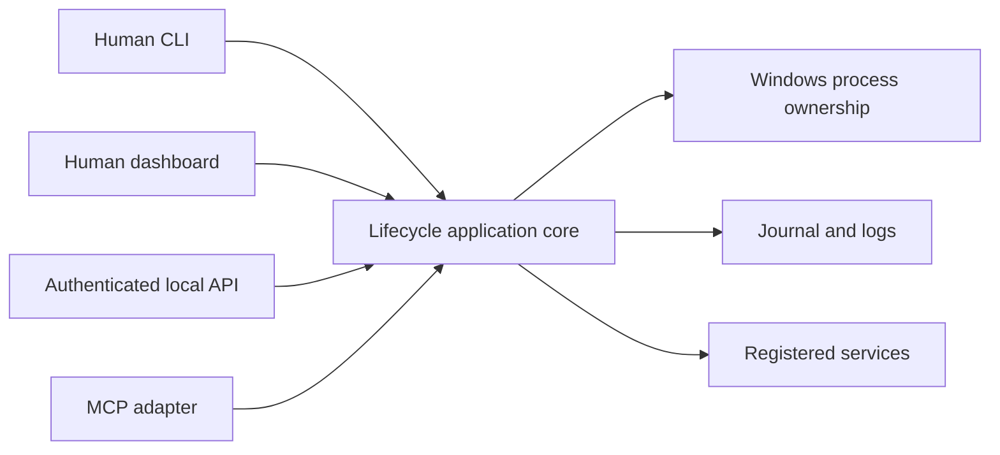

# AkuSupervisor MCP Integration Notes

Status: **Read-only implementation and Codex client registration live-validated**
Implementation target: **AkuWorkspace pilot after the lifecycle core became stable**
Current MCP protocol reference: **2025-11-25**

## 1. Purpose

This document records the implemented read-only MCP checkpoint and preserves
the deliberately unexposed mutation and bootstrap decisions.

MCP is an agent-facing adapter over the same lifecycle application core used by the CLI, dashboard, and authenticated local HTTP API. MCP is not the lifecycle core, the process-ownership mechanism, or the bootstrap mechanism for AkuSupervisor itself.

## 2. Startup scenarios

AkuSupervisor must distinguish three scenarios.

### 2.1 User-started supervisor

The user starts AkuSupervisor in a visible terminal. AkuSupervisor starts registered services in the normal Windows host context. Codex may later inspect or mutate those services through an authenticated control surface.

This remains the first implementation and validation path.

### 2.2 Agent-started service

AkuSupervisor is already running in the normal host context. Codex asks it to start, stop, or restart a registered service. The user retains visibility and final control.

This is compatible with the initial lifecycle architecture and does not require Codex to spawn the service directly.

### 2.3 Agent-started supervisor

Nothing is running and Codex asks a trusted host mechanism to launch AkuSupervisor. Directly spawning AkuSupervisor from a restricted agent runner is not sufficient because the supervisor and its descendants may inherit the restricted process context.

This later scenario requires a separately designed trusted bootstrap mechanism, such as an explicitly enabled user-session launcher. MCP does not solve this bootstrap problem.

## 3. Architectural position



The lifecycle application core owns all validation, authorization decisions, state transitions, serialization, journaling, and process operations. Protocol adapters must not reimplement those rules.

The stable internal boundary should accept typed operations such as:

```text
ListServices
GetService
StartService
StopService
RestartService
GetRecentEvents
ReadBoundedLogs
```

No adapter may supply an executable, working directory, argument list, environment map, port, or arbitrary shell text at invocation time.

The registration authority is the explicit exception at configuration time:
it accepts a complete typed service definition, validates it against the whole
profile, requires verbose hash-bound human approval, and commits it atomically.
Lifecycle calls still accept only a registered service ID.

## 4. MCP surface

AkuSupervisor now has two deliberately separate MCP identities:

- `/mcp` plus `mcp-proxy` remains the exact read-only runtime observation
  surface described below; and
- `registration-mcp` is an independent stdio authority for human-gated config
  registration through phase 4, including zero-disruption live registry
  reconciliation.

The registration authority does not grant lifecycle control and exposes no
approval tool. See [Human-Gated Service Registration](service-registration.md).

### 4.1 Read-only tools

```text
supervisor_list_services
supervisor_get_service
supervisor_get_recent_events
supervisor_read_logs
```

Log reads must be bounded by service, stream, line or byte count, and maximum response size.

The AkuWorkspace pilot implements these four tools as stateless Streamable HTTP
request/response operations. All tools declare `readOnlyHint=true`, forbid MCP
Tasks, reject unknown input fields, and return both text and bounded structured
JSON. Tool input failures are returned as tool execution errors so an agent can
self-correct. No MCP resource, prompt, sampling, subscription, or mutation
capability is advertised.

### 4.2 Mutation tools

```text
supervisor_start_service
supervisor_stop_service
supervisor_restart_service
supervisor_reload_extension
```

These tools are not exposed by the current MCP server. AkuBridge cooperative
self-reload is implemented through the authenticated CLI/HTTP control path, but
it remains intentionally absent from MCP so the four-tool surface stays
read-only. Service lifecycle mutations likewise remain CLI/HTTP operations.

Every mutation requires:

- a registered target ID;
- an authenticated principal;
- a non-empty reason;
- an idempotency key or equivalent duplicate-request protection; and
- a journal record before and after execution.

The authenticated principal determines the actor identity. A caller-provided `actor` string is display metadata only and cannot grant authority.

### 4.3 Resources

Potential read-only MCP resources:

```text
akusupervisor://status
akusupervisor://services/{serviceId}
akusupervisor://events/recent
```

Resource subscriptions may later provide status-change notifications. They are optional and must not become required for correctness.

### 4.4 Prompts and sampling

AkuSupervisor does not need MCP prompts or sampling. It is a deterministic local lifecycle tool and must not ask an MCP client to perform model inference as part of a lifecycle decision.

## 5. Transport decision

### 5.1 Primary: Streamable HTTP

The preferred MCP transport is Streamable HTTP on the already-running loopback control server, for example:

```text
http://127.0.0.1:47820/mcp
```

This preserves the independent, user-visible supervisor process. The MCP endpoint must:

- bind only to loopback;
- validate the `Origin` header when present;
- authenticate every client;
- reject tokens in query parameters;
- limit request and response sizes; and
- share authorization and rate-limit policy with the local control API.

Current checkpoint details:

- `/mcp` is opt-in through `control.mcp.enabled` and shares the existing
  loopback listener;
- it is stateless and returns JSON responses; GET/SSE and sessions are not
  advertised;
- every request requires the existing runtime bearer token;
- native clients may omit `Origin`, while a present value must exactly match
  `control.mcp.allowedOrigins`;
- protocol request bodies remain under the control API's 4 KiB cap and tool
  results are capped at 64 KiB; and
- protocol code is isolated in `src/adapters/mcp.rs` without an SDK dependency
  in the domain or application layers.

### 5.2 Compatibility: stdio proxy

If a client supports only stdio, use a small proxy:

```text
MCP client -> stdio proxy -> authenticated loopback API -> AkuSupervisor
```

The proxy may be launched by the MCP client because it does not own or spawn managed services. The long-lived AkuSupervisor process must not be replaced by a stdio child that inherits the MCP client's execution restrictions.

The AkuWorkspace checkpoint implements this as `aku-supervisor mcp-proxy`.
It resolves the ordinary Supervisor config, reads the existing protected token
file, and forwards newline-delimited JSON-RPC to `/mcp`. It emits no startup
text on stdout and exits if the Supervisor is unavailable. Codex is configured
with an explicit four-tool allow-list, so the token is not duplicated into
`config.toml` or an environment variable.

A newly started Codex task successfully loaded the project-scoped registration
and used the read-only MCP surface. This user-confirmed live check closes the
client-registration checkpoint; it does not expand MCP into service lifecycle
mutation or Supervisor bootstrap.

## 6. Human authority and agent policy

User authority remains higher than agent authority.

Suggested observable policy fields:

```text
desiredState: running | stopped
operatorHold: none | running | stopped
agentStartAllowed: true | false
lastRequestedBy: user.cli | user.ui | agent.mcp | recovery
```

Rules:

- `operatorHold=stopped` blocks agent start and restart requests;
- only an authorized user action may clear an operator hold;
- an explicit user stop disables automatic restart for that service;
- agent requests never override a user hold;
- every UI surface shows the requester, reason, time, and outcome; and
- the user can start or stop a service without using MCP.

## 7. Security considerations

MCP increases discoverability for agents and therefore also increases the mutation attack surface.

Required controls:

- expose only registered, typed operations;
- keep read-only and mutation capabilities distinct;
- never trust tool annotations as authorization evidence;
- protect against prompt-driven unintended mutations with server-side policy;
- validate token audience if standards-based HTTP authorization is adopted;
- never pass an MCP token through to another service;
- prevent DNS rebinding through loopback binding and Origin validation;
- redact tokens, environment secrets, and sensitive log content;
- cap concurrent and queued lifecycle actions; and
- preserve an audit trail independently of the MCP connection.

For the first local single-user implementation, the existing high-entropy local control token may be reused behind a protocol adapter if client compatibility permits. Full OAuth support should be added only when the deployment or client requirements justify its operational complexity.

## 8. Benefits

- Standard tool discovery and schemas for Codex and other MCP clients.
- A reusable agent interface that does not expose arbitrary shell execution.
- Structured status and lifecycle results.
- Optional resources, subscriptions, progress, and cancellation.
- An official Rust MCP SDK is available when this phase begins.

## 9. Costs and risks

- Additional authorization and input-validation surface.
- Client differences in approval UX and supported MCP features.
- Protocol and SDK evolution independent of the lifecycle core.
- Potential token cost from oversized logs or event results.
- Risk of confusing MCP connectivity with host-process bootstrap capability.
- Risk of coupling core domain types directly to an MCP SDK.

The official Rust MCP SDK is currently Tier 2. AkuSupervisor should isolate it behind an adapter module and pin a tested version.

## 10. Deferred acceptance criteria

MCP integration is ready only when:

- the CLI and local HTTP lifecycle paths already pass their acceptance tests;
- an MCP client can list and inspect services without mutation authority;
- mutation tools cannot target unregistered services or supply commands;
- actor identity comes from authentication rather than request text;
- user operator hold blocks agent mutations;
- restart returns a bounded structured result or operation handle;
- Streamable HTTP validates Origin and authentication;
- an optional stdio proxy never spawns managed services;
- all MCP operations create the same canonical journal events as CLI and HTTP; and
- disabling MCP does not affect human control or service correctness.

## 11. Resolved checkpoint decisions and deferred questions

Resolved for the AkuWorkspace read-only checkpoint:

- Codex project-scoped MCP registration is the first live client;
- Codex uses the bounded stdio compatibility proxy; and
- the proxy authenticates to local Streamable HTTP without storing the bearer
  token in Codex configuration.

Still deferred:

- Should mutation tools require an additional per-call user approval policy?
- When does local bearer-token authentication need to become OAuth-based authorization?
- Should lifecycle operations use ordinary tool calls with operation IDs or MCP Tasks after Tasks are no longer experimental?

## 12. References

- [MCP protocol versioning](https://modelcontextprotocol.io/docs/learn/versioning)
- [MCP transports](https://modelcontextprotocol.io/specification/2025-11-25/basic/transports)
- [MCP authorization](https://modelcontextprotocol.io/specification/2025-11-25/basic/authorization)
- [MCP tools](https://modelcontextprotocol.io/specification/2025-11-25/server/tools)
- [MCP resources](https://modelcontextprotocol.io/specification/2025-11-25/server/resources)
- [Official Rust MCP SDK](https://github.com/modelcontextprotocol/rust-sdk)
