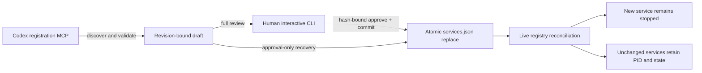

# Human-Gated Service Registration

Status: **Phases 1 through 4.2 implemented; phase 4 integration-validated on 2026-07-16**

AkuSupervisor exposes a separate stdio MCP server for discovering, validating,
preparing, and committing service registrations. It does not expand the
existing `/mcp` endpoint: that endpoint remains an exact four-tool read-only
view of an already-running Supervisor.

The registration server is intentionally useful before AkuSupervisor is
running. It edits only the selected typed configuration and never launches a
program.

## Authority boundary



The MCP process can prepare and commit but cannot approve. Approval requires a
real interactive terminal; piped stdin is rejected. Before accepting anything,
the CLI prints:

- operation, service ID, draft ID, expiry, base and proposed revisions;
- complete proposal hash and exact confirmation phrase;
- warnings and a structured change summary;
- the full current configuration; and
- the full proposed configuration.

The human must type `APPROVE <service-id> <hash-suffix>` exactly. Approval is
bound to that proposal hash and expires with the draft after 30 minutes.

## Self-describing MCP workflow

Install both the registration server and read-only server with:

```powershell
.\scripts\install-codex-mcp.ps1
```

This first produces a bounded plan showing the exact two target sections and an
approval command. Apply requires that hash-bound code, preserves unrelated
Codex configuration, stages the dedicated MCP host, and reports whether Codex
must be restarted. The resulting registration section is:

```toml
[mcp_servers.aku_supervisor_registration]
command = "C:\\path\\to\\AkuSupervisor\\target\\mcp\\aku-supervisor-mcp.exe"
args = ["registration-mcp"]
enabled = true
enabled_tools = [
  "supervisor_registration_get_capabilities",
  "supervisor_registration_get_schema",
  "supervisor_registration_validate_service",
  "supervisor_registration_prepare_change",
  "supervisor_registration_get_draft",
  "supervisor_registration_commit_change",
]
```

Both read-only and registration MCP entries point to the same staged file. Core
promotion does not replace it, and an MCP host update is needed only when MCP
behavior changes. A workspace-level `.codex\config.toml` serves all Codex
tasks/agents in that workspace. Initial MCP discovery cannot install itself, so
each new workspace needs this one explicit bootstrap and human approval.

The agent does not need this document during normal registration. Tool
descriptions, strict input schemas, structured failures, the current revision,
workflow, safety policy, approval command, and complete service schema are all
available from MCP:

1. `supervisor_registration_get_capabilities`
2. `supervisor_registration_get_schema`
3. `supervisor_registration_validate_service`
4. `supervisor_registration_prepare_change`
5. ask the user to run the returned `approvalCommand`; its `--commit` option
   completes both approval and mutation after the review
6. after the user responds, call `supervisor_registration_commit_change`
   idempotently to retrieve or confirm the final result

No registration approval tool exists. The agent follow-up is useful for
visibility and recovery, but the mutation no longer depends on the agent
continuing after the human approves it. This is a runtime contract returned by
MCP, not knowledge that must be recovered from this document.

## Foreground visibility

The foreground Supervisor follows new records appended to
`.runtime/registration/audit.jsonl`. This makes actions performed by the
separate MCP and approval processes visible in the watcher terminal:

```text
[2026-07-16T09:36:08.377Z] [registration] prepared register api by agent/registration_mcp (draft=registration-..., request=..., revision=sha256:...)
[2026-07-16T09:36:15.124Z] [registration] approved register api by user/human_cli (draft=registration-..., request=..., revision=sha256:...); authorization recorded, configuration unchanged until commit
[2026-07-16T09:36:15.173Z] [registration] committed register api by user/human_cli (draft=registration-..., request=..., revision=sha256:...); transaction finalized
```

Only records appended after the Supervisor begins following the file are
printed, so a restart does not replay historical approvals. Partial JSONL lines
are retained until complete, malformed or oversized records fail visibly, and
the console representation is bounded to one line. Full proposal content and
environment values remain absent from the audit.

## Human commands

Inspect live capabilities and the current revision:

```powershell
.\target\aku-supervisor.exe registration capabilities
```

Inspect a draft again without approving it:

```powershell
.\target\aku-supervisor.exe registration show registration-0123456789abcdef0123
```

Approve and commit only after reading the entire output (recommended):

```powershell
.\target\aku-supervisor.exe registration approve registration-0123456789abcdef0123 --commit
```

The CLI states before prompting that the exact proposal will be committed. On
success it prints `APPROVED AND COMMITTED` and the complete structured result.
If commit fails after approval, rerun the same command; the approved draft is
resumed without requiring another agent or another approval phrase.

Advanced two-phase workflows may omit `--commit`. In that mode the command
prints `APPROVED ONLY`, `services.json` remains unchanged, and either the same
human command with `--commit` or the idempotent MCP commit tool must finish the
transaction.

## Transaction and lifecycle rules

- A draft records the complete before and after configuration, exact base
  revision, proposed revision, request ID, proposal hash, and expiry.
- Reusing a request ID for the same proposal returns the same draft. Reusing it
  for different input fails.
- Commit takes an exclusive registration lock, rereads the configuration, and
  requires the exact base revision. Concurrent or stale changes fail without
  replacing the file.
- The new configuration is validated again and written to a temporary file in
  the same directory. Windows uses `MoveFileExW` with replace and write-through;
  Linux and macOS use same-filesystem atomic rename behind the platform adapter.
- If the configuration replacement succeeded but draft bookkeeping was
  interrupted, retry recognizes the proposed revision and completes the draft
  record instead of applying a second mutation.
- Register always persists the service as registered but stopped. It never
  starts the service.
- Update and unregister fail closed unless the running Supervisor reports the
  target lifecycle as exactly `stopped` at commit time.
- Unregistering the final service is rejected by the existing configuration
  invariant that requires at least one registered service.
- A running foreground Supervisor notices the valid atomic replacement and
  reconciles only `services`. New registrations enter as stopped; unchanged
  entries retain their process owner, PID set, health, operator hold, and
  restart state. No Supervisor handoff and no unrelated-service restart occurs.
- Update and unregister are applied only while their target remains stopped. If
  a race makes the target active after commit validation, reconciliation is
  deferred and retried; the running service is never detached or silently
  replaced.
- Non-service settings (`control`, `observability`, cooperative actions, or
  config version) still require an explicit Supervisor restart. Registration
  MCP cannot change those fields.
- If no Supervisor is running, the next normal startup loads the committed
  configuration; no special promotion or reload action is required.

## Runtime acknowledgment

Commit polls the authenticated runtime boundary with one absolute two-second
deadline shared by connect, write, polling delay, and response reads, and
returns `applied`, `pending`, `deferred`, `rejected`, or `offline`. The first
four values describe a running Supervisor; `offline` means no compatible
runtime could be queried and the committed file will be loaded on the next
normal startup.

The result also carries `runtimeActiveRevision`, `runtimeDiskRevision`, and a
bounded `reconciliationDetail`. Inspect the same secret-free runtime truth at
any time with:

```powershell
.\target\aku-supervisor.exe registry-status
.\target\aku-supervisor.exe registry-status --json
```

The authenticated `GET /v1/registry` endpoint is deliberately separate from
the four-tool read-only MCP endpoint.

The ordinary service table remains quiet when revisions match. When they do
not, `simple-status` prepends a bounded `REGISTRY WARNING`, so an operator does
not have to remember a second command to notice a deferred or rejected change.

After commit reports `applied` and the watcher prints `[registry] Applied
revision ... without Supervisor handoff` (or `simple-status` shows the new
stopped entry), start it separately:

```powershell
.\target\aku-supervisor.exe start <service-id> `
  --actor user `
  --reason "start newly registered service"
```

## Security scope

Registration accepts a typed executable path plus fixed argv entries, never an
arbitrary shell expression supplied at lifecycle invocation time. Existing
configuration validation requires absolute existing `cwd` and `command` paths,
loopback health checks, bounded deadlines, and non-conflicting declared ports.

Environment values are stored in plain JSON and displayed during approval.
Keys that look like secrets (`SECRET`, `TOKEN`, `PASSWORD`, `PASSWD`,
`API_KEY`, `PRIVATE_KEY`, or `CREDENTIAL`) are rejected. Programs should retain
secrets in their own protected configuration or a future dedicated secret
adapter.

This boundary prevents accidental or prompt-driven registration through the
MCP workflow; it is not an operating-system privilege boundary against another
process already running as the same user. Stronger approval attestation would
require an OS-native consent or credential mechanism and remains future work.

## Runtime files

Draft and audit state lives beside the selected control token:

```text
.runtime/
  registration/
    audit.jsonl
    commit.lock
    drafts/
      registration-<request-hash>.json
```

`commit.lock` exists only during a commit. If a process crashes while holding
this simple portable lock, verify that no registration MCP process is running
before deleting the stale file.

## AkuWorkspace live acceptance

The stable registration MCP completed reversible acceptance cycles against the
active default profile. The latest zero-disruption proof:

- began at revision `sha256:f8a5e9bc...de17b98` with Supervisor PID `32660`
  and AkuSidecar PID `34620`;
- registered `registration-smoke` at revision
  `sha256:3e947a56...b24216c`; the entry appeared stopped without a PID while
  both baseline PIDs remained unchanged;
- a separate agent subsequently performed an explicit Sidecar development
  rebuild, recorded as lifecycle events `#891/#892`; this was not caused by
  registration reconciliation;
- unregister removed the smoke entry and returned the exact initial revision
  while retaining the same Supervisor process and the then-current healthy
  Sidecar owner; and
- the audit persisted prepared, human-approved, and MCP-committed records for
  both directions without launching the smoke service.

The earlier phase-3 acceptance also established the approval and transaction
boundaries:

- discovered revision `sha256:b7bbb1e0...b4411` and the complete service
  schema without external documentation;
- validated and prepared `registration-smoke`, pointing to the stable
  AkuSupervisor binary with only `--version` and no port;
- rejected MCP/piped approval while accepting the user's exact interactive
  hash-bound confirmation;
- atomically registered the service at revision
  `sha256:c0351244...f758d` without starting it;
- the development watcher performed its normal handoff, restored AkuSidecar as
  `running / healthy`, and exposed `registration-smoke` as
  `stopped / stopped` with no PID;
- unregister required a second full human approval and observed stopped-state
  evidence; and
- the second atomic commit removed the smoke service and returned the profile
  exactly to revision `sha256:b7bbb1e0...b4411` while AkuSidecar remained
  healthy.

The registration audit contains separate `prepared`, `approved`, and
`committed` records for both operations. No smoke process was launched and no
temporary service remains in the active configuration.
